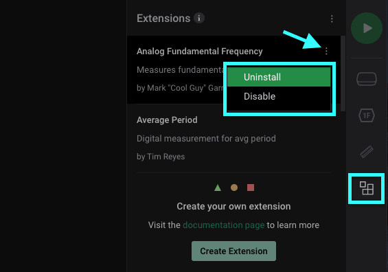

# Installing Extensions

There are 2 methods to installing an extension.

### Install Extensions within the Software

This will be the easiest method of installing an extension. Clicking on the Extensions button on the right will open up a list of published extensions from us and from the community. Afterwards, you can click "Install" for the extension of your choice.

### Install Extensions Manually

In some cases, the extensions list may not appear properly within the Extensions panel of the software. This may be due to security settings such as a firewall, or simply having the PC offline. To get around this, extensions can be found on GitHub and can be downloaded manually using the following steps.

1. On a computer where the marketplace loads, click the extension of interest so that it is highlighted. This will open up the extension information within the software. 
2. Click the "Repository" link. This opens the [github.com](http://github.com/) repository for that extension.
3. Click the green "Code" button, and select download as zip.
4. Extract the zip file anywhere.
5. In the Logic 2 software, on the Extensions panel, click the "three-dots" menu icon, select "Load Existing Extension..." and select the downloaded extension.json file.

### Uninstalling an Extension

To uninstall an extension, click on the 3 dots next to an extension in the Extensions panel. Then click Uninstall.

