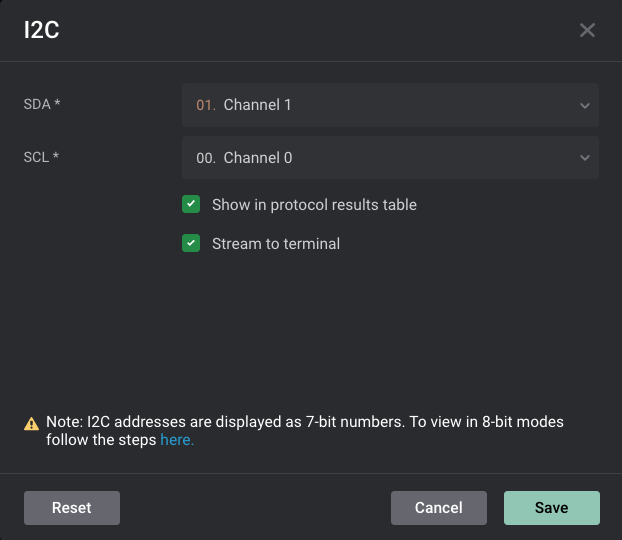

# I2C Analyzer - User Guide

The Saleae software includes a protocol analyzer for the I2C protocol.

The I2C protocol is a synchronous serial interface that uses one clock channel \(SCL\) and one data channel \(SDA\). The analyzer will parse the address, direction \(read/write\) data, and ACK/NAK frame from I2C transactions. 

It will also use markers to indicate the start and stop conditions. This is indicated by a green circle and an orange square respectively, as shown in the image above. 

### Analyzer Settings

In the settings, specify which input channels are used for the I2C signals SDA and SCL. Please note that I2C addresses are displayed as 7-bit numbers. We share a support article below to help display I2C addresses as 8-bit if preferred.



### **Common Issus with Noise Around Clock Edges**

If you notice that our I2C analyzer fails to decode data, a common failure point is typically glitches/noise around the SCL signal edges. I2C is particularly vulnerable to this issue due to the slow rise times caused by the open drain bus topology. The relatively slow signal rise time through the threshold region of the logic analyzer input buffer can sometimes cause these glitches to occur.

You may notice where the analyzer seems to decode less than 9 bits per frame, or incorrect results. If you notice this, carefully zoom in around each clock edge in the problem frame and check to see if there is a "glitch" or narrow pulse present next to the clock transition that is causing a clock edge to be detected as multiple edges.

This can happen for several reasons, and we've added a software feature to allow these "glitches" to be filtered out. See this article for instructions.



Besides using the glitch filter, you may also want to try reducing the sample rate of the capture, using a different IO voltage option if supported by your logic analyzer, or filtering the electrical signal at the hardware level.

### Why does every read transaction get preceded by a write transaction?

If you're new to I2C, you may notice that a read operation may be preceded by a write transaction when one was not expected. That is most likely because the I2C slave you are using first expects the master to write the desired address that should be read back later. Since a read transaction is only unidirectional, the read transaction can't be used to inform the slave of the read address. In many cases, this is done by the master first starting with a write transaction where the target read address is sent to the slave, followed by a I2C "re-start" condition, which then allows the master to begin a read transaction. Now that the slave device is aware of the desired read address, it can transmit this data back to the master.

