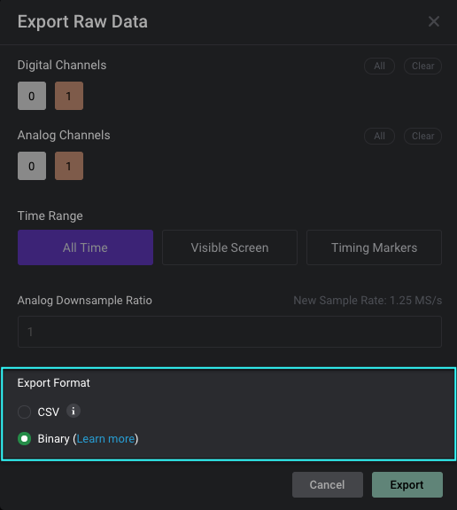

# Exporting Raw Data to CSV Takes is Slow

We've received a few recent reports of export speed being slow when exporting raw data to a csv file. Unfortunately, exporting to a csv file has its limits, and the time it takes to process the data depends on the following:

* Number of digital transitions in your data
* Number of analog samples in your data
* Your PC specifications

### Performance Expectations

We might be able to squeeze out a bit more performance in terms of speed, though due to the csv file format itself, the speed increase may be in the order of a few 10s of percent. We wouldn't be able to drastically increase the speed by 10x.

### Troubleshooting Steps

Besides the csv format being quite inefficient, one area that might be causing a bottleneck in speed is the target location for the export file. For example, saving to a network drive or an external usb drive will cause limitations in export speed.

We plan to improve the performance of our software, but in the meantime, here are some workarounds.‌

1. Export only a section of the data
2. Export only a few channels
3. Export to binary rather than CSV. We also have a sample python script to read binary data \(provided in the link below, at the bottom of the article\).



### How Many Digital Transitions are in my Captured Data? 

Since export performance is related to how many digital transitions occur in your data, you can check this by using our built-in Clock Stats measurement extension. Install the extension \(it should be installed by default\) and SHIFT+drag across your entire range of digital data to count the number of rising edges and falling edges in your capture.

### Exporting via Binary File - A Much Faster Approach

An alternative approach \(much faster and produces a smaller file\) would be to export to a binary file. More details on the binary file format can be found in the link below.



