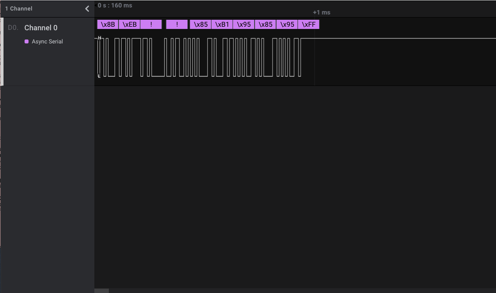

# Set an Analyzer Starting Point in your Capture

There are times where you may need to manually set the starting point in time for your protocol analyzer to begin decoding data. 

Our protocol analyzers are designed to decode all captured data from beginning to end. Manually setting the starting point for an analyzer may fix issues such as data offsets, especially in cases where your capture begins right in the middle of a data message, which potentially causes errors for decoding the rest of your data.

One way to manually set the starting and ending points for protocol analyzer decoding is to delete portions of your capture as per the instructions below, such that the data that is left over is the relevant data that you need to decode.



### Why Would I Need to Do This?

One common scenario for this need is when the beginning of your data capture occurs right in the middle of a data transaction/message as mentioned above.

In this case, our protocol analyzers don't have a way of determining if your capture begins right in the middle of a data transaction/message. It will simply begin decoding the moment it starts seeing digital transitions in your data. This can sometimes cause issues with decoding data, and may cause your decoded data to be incorrect, or offset in time.

For example, take a look at the ideal capture case below. The capture begins before the data begins. Therefore, the protocol analyzer is able to decode the entire message correctly.

But... what happens if the capture began right in the middle of a data message, such as in the below image? In this case, it's possible that all subsequent decoded data may be incorrectly decoded due to the offset this causes.

By deleting the portions of your data that might be causing this issue \(most commonly the beginning of data captures being located right in the middle of a data message\), this issue will most likely be solved.

We're looking into ways to improve the behavior of our analyzers with respect to detecting these conditions and correcting for it automatically.

If you have any feedback, feel free to let us know below!

* [Ideas Forum](https://ideas.saleae.com/b/feature-requests/)
* [Contact Us](https://contact.saleae.com/hc/en-us/requests/new)

