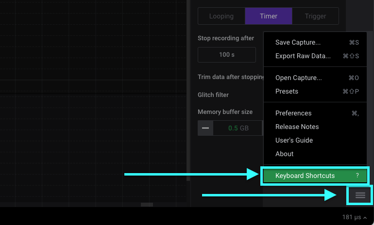

# Keyboard Shortcuts

## Logic 2.x

The list of keyboard shortcuts for the Logic 2 software can be viewed by clicking the Options button on the bottom right, then clicking "Keyboard Shortcuts." You can also use the "?" key on your keyboard to quickly open the list of keyboard shortcuts in the software.

## Logic 1.x

If you are using the older Logic 1.x software, the keyboard shortcuts are listed below


On OSX, CTRL is replaced by Command


**Start a Capture**: CTRL-R

**Stop a Capture**: ESC or Enter \(presses the Stop button\)

**Move Right/Left**: Right/Left Arrow Keys \(Add CTRL to move faster\)

**Zoom In/Out**: Up/Down Arrow Keys \(Add CTRL to move faster\). Also Plus and Minus \(+/-\)

**Zoom to Region**: Shift+Click and drag over region to zoom

**Zoom All the Way Out**: Ctrl+0

**Place Timing Markers**: All numbers 1=A1, 2=A2, 3=B1, and so on

**Add measurement**: "M" and then click twice to place both ends of the measurement

**Add bookmark**: "B" and then type the name for that bookmark

**Jump to Next/Previous Bookmark**: CTRL+N/CTRL+P

**Open Options Menu**: ALT-O

**Save Session**: CTRL-S

**Save Session, Settings Only**: CTRL-SHIFT-S

**Open Session**: CTRL-O

**Export Data**: CTRL-E

**Take Screenshot**: CTRL-I

**Change Radix**: SHIFT-A \(Ascii\), CTRL-H \(Hex\), CTRL-B \(Binary\), CTRL-D \(Decimal\), CTRL+SHIFT+A \(Ascii and Hex\). Note: This changes the global radix.

**Jump Left/Right** to Next Edge: N \(Next\), P \(Previous\). Note: This applies to the channel where you last clicked the Next/Previous button \(appears at the beginning/end of a channel\).

**Jump to Next/Previous Trigger Event**: SHIFT+N/SHIFT+P

**Jump to Trigger Location \(Time 0\)**: Home

**Jump to End of Capture**: End

**Scroll Channels Up/Down**: Page Up/Page Down. Note: This applies when more channels are viable than fit vertically on the screen. Use CONTROL to scroll to top or bottom.

**Resize Selected Channels**: CTRL-1, CTRL-2, CTRL-3, CTRL-4 for each of the four channel sizes.

**Select All Channels**: CTRL-A

