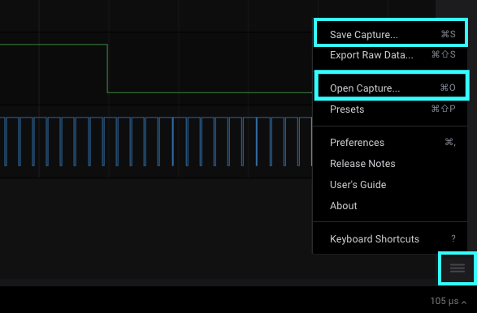

# Capture & Preset File Management

### Saving & Opening Captures

To save your current capture tab, click the Options button at the bottom right of the software, and click "Save Capture." To open an existing capture file \(.sal format\), click the Options button and click "Open Capture."

## Logic 1.x

If you are using the older Logic 1.x software, the following images and instructions apply.

### **Saving Captures**

_Note: Saving a capture only saves the currently selected tab._

To save your current capture, click the Options menu on the top right of the software and select Save capture. You can also press CTRL-S.

### **Opening Captures**

To open a previously saved capture, click the Options menu on the top right of the software and select Open Capture. You can also press CTRL-O.

You can also drag a capture file into the Logic software.

On Windows, you can double-click a capture file to open it in the Logic software.

### **Saving Capture Settings**

To save your capture settings, click the Options button at the top right and select Save Setup. From there, you will be prompted to save a .logicsettings file. The .logicsettings file will save the settings associated with the current active tab. You can find the tabs at the bottom of the software UI.

### \*\*\*\*

