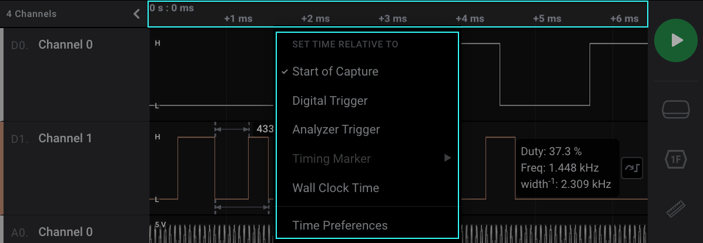
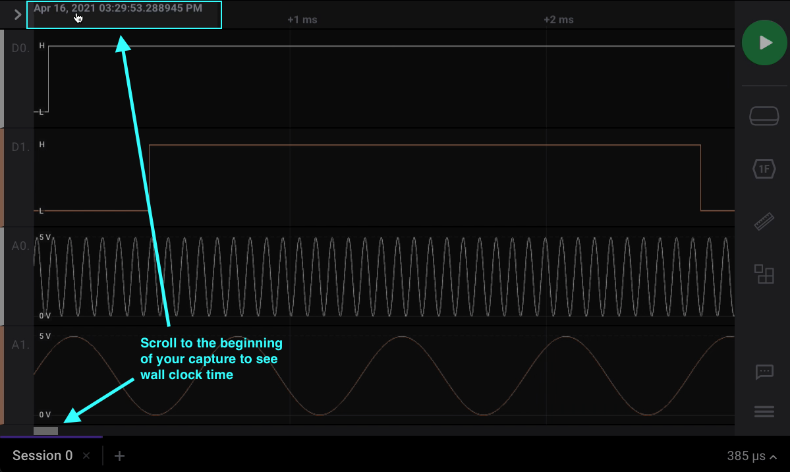

# Time Bar Settings

The time bar located at the top of the software helps with visualizing the time at which events occur in your capture. In addition, right-clicking on the time bar will allow configuration with regards to how time is displayed.

### Setting the Time Relative to Events

The time point at which t=0s occurs can be configured to the following events

* **Start of Capture**: Sets the start of the capture as t=0s
* **Digital Trigger**: In a digital triggered capture, this sets the point at which the digital trigger occurs as t=0s
* **Analyzer Trigger**: If the trigger was the result of an Analyzer Trigger \(located under the Analyzers panel &gt; Trigger View\), then the point at which the trigger occurred will be t=0s.
* **Timing Marker**: If any timing markers are present, then the selected timing marker will be set as t=0s. As an alternative, you can also right-click on your timing marker and select "Set as t0" in the pop up menu.

### Wall Clock Format

* **Wall Clock Time**: Changes the time format to your OS wall clock


The Wall Clock Time format setting will only show up when you pan the capture all the way to the left \(i.e. at the beginning of the capture\). When you are zoomed in anywhere else in the capture, the wall clock time will not appear.


### Time Preferences

The Time Preferences may also be opened for further customization on the time bar behavior.

